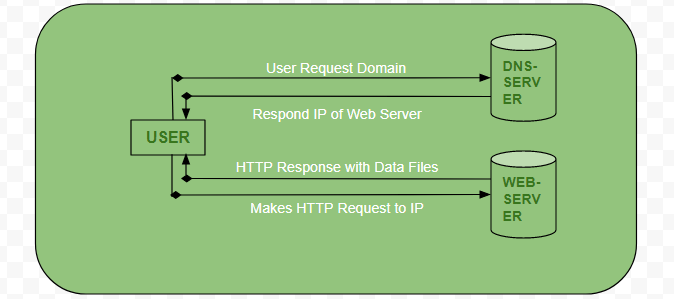

# Client Server Model  
The client-server model describes how a server provides resources and services to one or more clients. Examples of servers include web servers, mail servers, and file servers. Each of these servers provide resources to client devices, such as desktop computers, laptops, tablets, and smartphones. Most servers have a one-to-many relationship with clients, meaning a single server can provide resources to multiple clients at one time.  

A client doesn't necessarily know _what_ the server is, it just knows that it can request information from it. Behind the scenes, a client does a DNS query to determine the IP address of the server needed in order to request information from it.  

A server usually listens to requests on specific ports. Any machine that has a distinct IP address has ~16k ports that programs can listen to. As a client, you have to specify the port that you want to communicate on. Most clients know the port that they should use depending on the protocol that is being used. For example, if a client is trying to speak to a server with HTTP, it uses port 80. A client using HTTPS uses port 443.  

## Key Terms  
### Client  
A machine or process that requests data or service from a server.  

Note that a single machine or piece of software can be both a client and a server at the same time. For instance, a single machine could act as a server for end users and as a client for a database. Once a client has a server's IP address, it can send an HTTP request to request information. That request includes the IP address of the client, which allows the server to know what IP address to send the response.  

### Server  
A machine or process that provides data or service for a client, usually by listening for incoming network calls.  

Note that a single machine or piece of software can be both a client and a server at the same time. For instance, a single machine could act as a server for end users and as a client for a database.  

### Client-Server Model  
The paradigm by which modern systems are designed, which consists of clients requesting data or service from servers and servers providing data or service to clients.  

### IP Address  
An address given to each machine connected to the public internet. IPv4 addresses consist of four numbers separated by dots: __a.b.c.d__ where all four numbers are between 0 and 255. Special values include:  
* __127.0.0.1__: Your own local machine. Also referred to as __localhost__.
* __192.168.x.y__: Your private network. For instance, your machine and all machines on your private wifi network will usually have the __192.169__ prefix.  

### DNS  
Short for __Domain Name System__, it describes the entities and protocols involved in the translation from domain names to IP Addresses. Typically, machines make a DNS query to a well known entity which is responsible for returning the IP address (or multiple ones) of the requestsed domain name in the reponse.
