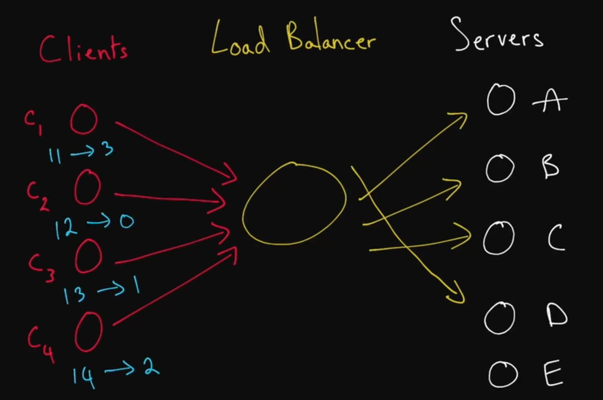
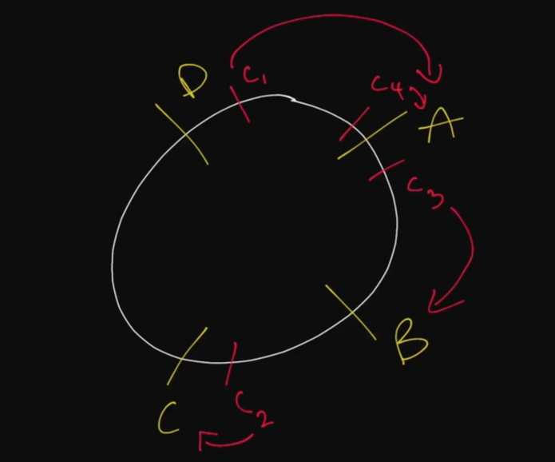
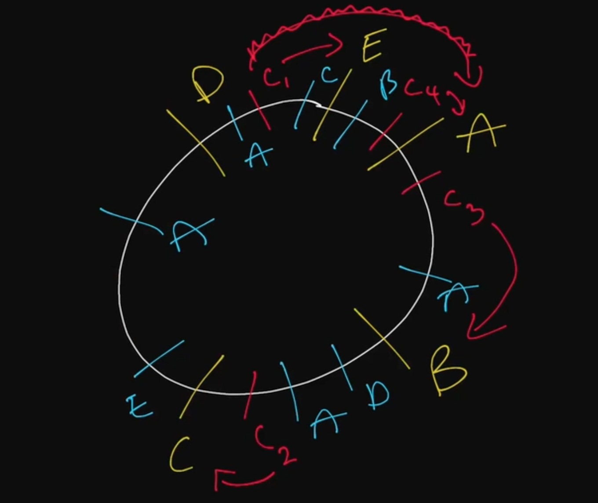

# Hashing  
Hashing is an action that you can perform to transform an artibtrary piece of data into a fixed size integer value. Hashing can be used for user data, IP data, or any other piece of data in a system. 

In regards to system design, when a load balancer reroutes requests from a client to a server, it has to determine a server selection strategy to use. If a load balancer is rerouting requets with round robin or a randomized strategy, it is unlikely that re-requested data will produce a cache hit in the same server the request was originally made. Cache hits will be missed when requets are routed to servers that do not have the previously requested data cached. 

This is where hashing comes in. With hashing, you can hash the requests coming into the load balancer, and based on the hash, you can bucket the requests depending on the locaiton of the servers. An example would be hashing the names (IP addresses) of clients making requests, and 'modding' the individual results by the number of servers available. The result will be a number between 0 and (numberOfServers - 1). It is important for hashing functions to have uniformity - evenly distributing data values across available output values. 

In large scale distributed systems, servers may die or be added to the server farm handling requests. If the number of servers changes, the hashing algorithm needs to change the number that hashes are modded by. This will completely change the servers that requests are being routed to, subsequently losing the cached data in servers. How do you solve this problem? Consistent Hashing and Rendezvous Hashing.

Consistent hashing organizes servers in a 'circle' represented by a series of sequential numbers, rather than a straight line. The way that servers are distributed in this 'circle' is by putting the server name through a hashing function. The same thing is done with clients (IP addresses, usernames, HTTP requests, etc.), and the hash result is placed on the circle. Now, to determine which server a client's request is routed to, you can move counter/clockwise on the circle to the closest server.

In this example, if a server dies or is added, the client's request will still be made to the closest server. Thus, if the server number changes, only a few of the clients have to reroute their requests to new servers. In order to more evenly distribute requests, server IDs may go through multiple hashes and placed on multiple parts of the server. This can also be useful if one server is more powerful than others, allowing it to receive more traffic than others in the system. 

Rendezvous Hashing will calculate a score or ranking of server destinations for each client making a request. When adding or removing servers from the system, each client's ranking of servers will be updated accordingly. If the highest weighted destination server is removed, the next highest weighted server will be the new destination for requests.

## Prerequisites  
* Hashing Function
* Load Balancer

## Key Terms  
### Consistent Hashing  
A type of hashing that minimizes the number of keys that need to be remapped when a hash table gets resized. It's often used by load balancers to distribute traffic to servers; it minimizes the number of requests that get forwarded to different servers when new servers are added or when existing servers are brought down.  

### Rendezvous Hashing  
A type of hashing also coined __highest random weight__ hashing. Allows for minimal re-distribution of mappings when a server goes down.  

## SHA  
Short for "Secure Hash Algorithms", the SHA is a collection of cryptographic hash functions used in the industry. These days, SHA-3 is a popular choice to use in a system.
