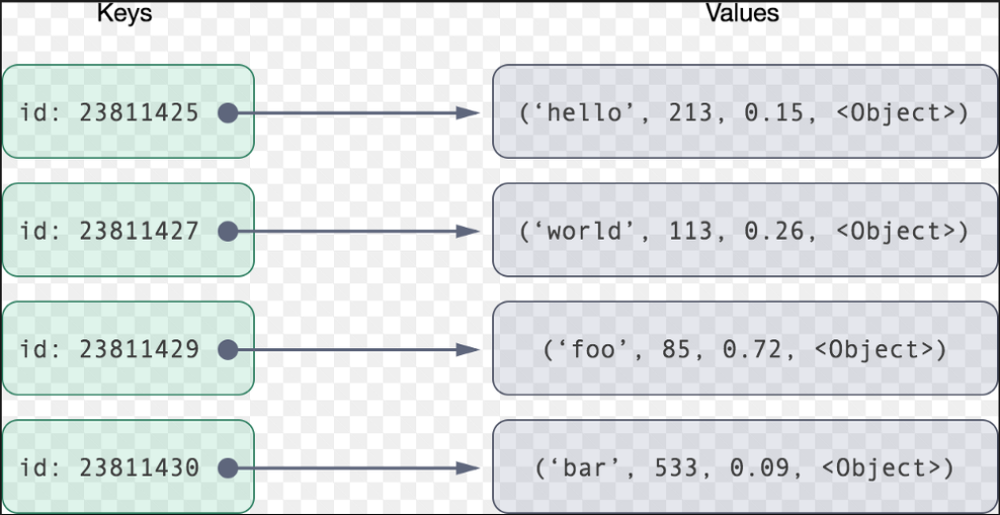

# Key-Value Stores  
A key-value store, or key-value database is simply a database that uses an associative array (like a map or dictionary) as the fundamental data model where each key is associated with one and only one value in a collection. This relationship is referred to as a key-value pair. 

In each key-value pair the key is represented by an arbitrary string such as a filename, URI or has. The value can be any kind of data like an image, user preference file or document. The value is stored as a blob requiring no upfront data modeling or schema definition. The storage of the value as a blob removes the need to index the data to improve performance. However, you cannot filter or control what's returned from a request based on the value because the value is opaque. Hash tables in JavaScript act as key-value stores.

In general, key-value stores have no query language. They provide a way to store, retrieve and update data using simple *get*, *put* and *delete* commands; the path to retrieve data is a direct request to the object in memory or on disk. The simplicity of this model makes a key-value store fast, easy to use, scalable, portable and flexible.

Key-value stores scale out by implementing partitioning (storing data on more than one node), replication and auto recovery. They can scale up by maintaining the database in RAM and minimize the effects of ACID guarantees.

Key-value stores handle size well and are good at processing a constant stream of read/write operations with low latency, making them perfect for:
* Session management at high scale
* User preference and profile stores
* Product recommendations; latest items viewed on a retailer website drive future customer product recommendations
* Ad servicing; customer shopping habits result in customized ads, coupons, etc. for each customer in real-time
* Can effectively work as a cache for heavily accessed but rarely updated data

## Prerequisites  
* Relational Database
* Non-Relational Database

## Key Terms  
### Key-Value Stores  
A Key-Value Store is a flexible NoSQL database that's often used for caching and dynamic configuration. Popular options include DynamoDB, Etcd, Redis, and ZooKeeper.

### Etcd ☆  
Etcd is a strongly consistent and highly available key-value store that's often used to implement leader election in a system.  
Website: [https://etcd.io/](https://etcd.io/)

### Redis ☆  
An in-memory key-value store. Does offer some persistent storage options but is typically used as a really fast, best-effort caching solution. Redis is also often used to implement __rate limiting__.  
Website: [https://redis.io/](https://redis.io/)

### ZooKeeper ☆  
ZooKeeper is a strongly consistent, highly available key-value store. It's often used to store important configuration or to perform leader election.  
Website: [https://zookeeper.apache.org/](https://zookeeper.apache.org/)
