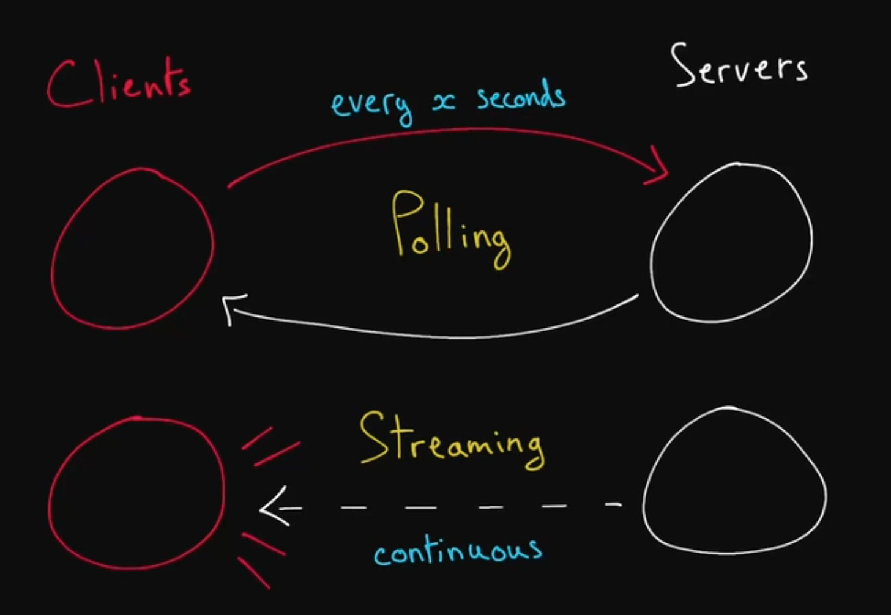

# Polling And Streaming  
In typical system design architecture, clients make requests to servers who send responses back to the end user. However, there may be scenarios where a client would like to receive data that is regularlyu pdated on the server. This is where polling and streaming come into play.

__Polling__ allows clients to send a request to a server on a set interval. An example of a use case for polling may be sending requests to a server for the temperature outside. However, polling may not be useful for applications that require a client having instantaneous updating of server data - such as in a chat app. In this case, the client would prefer to be polling multiple times every second, approaching an infinite amount of polling to receive the most recent data.

__Streaming__ allows clients to open a long-lived connection to a server - typically a socket: an open connection between two machines - that listens to a server for any data that may be pushed to the client. With streaming, a server can push data to a client whenever there is more data. A client is always listening, but does not need to make requests. People will often refer to servers proactively sending data to a client as "pushing". Streaming allows for a *continuous* stream of data.

Streaming is not necessarily better than polling - it depends on the use case. The general rule of thumb is: if you need instantaneously updated data, use streaming. If you need data updated semi-regularly, you will probably use polling. 

## Prerequisites  
* Client-Server Model
* Socket

## Key Terms  
### Polling  
The act of fetching a resource or piece of data regularly at an interval to make sure your data is not too stale.  

### Streaming  
In networking, it usually refers to the act of continuously getting a feed of information from a server by keeping an open connection between two machines or processes. 