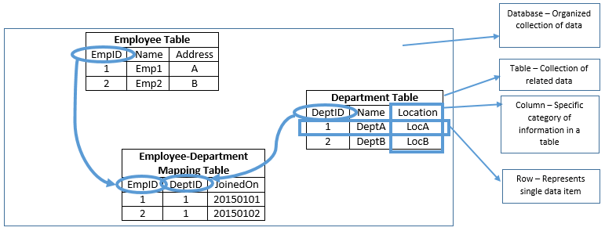

# Relational Databases
The Relational Model of databases was developed to model data in the form of relations or tables. In a table, columns represent attributes, while rows represent individual records. Data stored in a RDBMS is very structured and well defined. 

In contrast to relational databases, non-relational databases do not impose a table-like structure on the data. However, different forms of structural schema may be used. 

Most relational databases support SQL - Structured Query Language. SQL is a programming/database language that is used to perform complex queries in databases. Not all relational databases support SQL, but so many do that the term is often used interchangeably with RDBMS. The ability to perform complex queries is one of the primary reasons to use a RDBMS.

One example of this is if you are trying to query a database with multiple filters - i.e. users who made a purchase in the last month and are currently logged in. While you can filter for this data with queries in JavaScript or Python, if you are dealing with a large scale distributed system, this may be be terrabytes of data that needs to be stored in memory. RDBMS/SQL databases allow for these queries to be run in the database.

A SQL database must use ACID transactions (atomic, consistent, isolated, durable).
* Atomicity - If a database transaction has multiple sub-steps, they either all fail or all complete
* Consistency - All transactions abide by the rules of the database. And any new transactions take into account all past transactions.
* Isolation - Multiple transactions can occur at the same time, but they effectively act as if they were queued one after another.
* Durability - When you make a transaciton in a database, the effects of that transaction is permanent. 

RDBMS may use a database index to create an auxiliary data structure that is optimized for fast searching on a specific attribute or column. By having a sorted list to search data by, search time can be reduced from linear time to log time. Having a database index will take up more space and time during write operations. However, read operations will be a lot faster.

## Prerequisites
* Databases
* Disk
* Memory

## Key Terms  
### Relational Database  
A type of structured database in which data is stored following a tabular format; often supports powerful querying using SQL.  

### Non-Relational Database  
In contrast with relational database (SQL databases), a type of database that is free of imposed, tabular-like structure. Non-relational databases are often referred to as NoSQL databases.  

### SQL  
Structured Query Language. Relational databases can be used using a derivative of SQL such as PostgreSQL in the case of Postgres.  

### SQL Database  
Any database that supports SQL. This term is often used synonymously with "Relational Database", though in practice, not _every_ relational database supports SQL.  

### NoSQL Database  
Any database that is not SQL compatible is called NoSQL.  

### ACID Transaction  
A type of database transaction that has four important properties:  
* __Atomicity__: The operations that constitute the transaction will either all succeed or all fail. There is no in-between state.
* __Consistency__: The transaction cannot bring the database to an invalid state. After the transaction is committed or rolled back, the rules for each record will still apply, and all future transactions will see the effect of the transaction. Also named __Strong Consistency__.  
* __Isolation__: The execution of multiple transactions concurrently will have the same effect as if they had been executed sequentially.
* __Durability__: Any committed transaction is written to non-volatile storage. It will not be undone by a crash, power loss, or network partition.  

### Database Index  
A special auxilary data structure that allows your database to perform certain queries much faster. Indexes can typically only exist to reference structured data, like data stored in relational databases. In practice, you create an index on one or multiple columns in your database to greatly speed up __read__ queries that you run very often, with the downside of slightly longer __writes__ to your database, since writes have to also take place in the relevant index.  

### Strong Consistency  
Strong Consistency usually refers to the consistency of ACID transactions, as opposed to __Eventual Consistency__.

### Eventual Consistency  
A consistency model which is unlike __Strong Consistency__. In this model, reads might return a view of the system that is stale. An eventually consistent datastore will give guarantees that the state of the database will eventually reflect writes within a time period (could be 10 seconds, or minutes).

### Postgres ☆  
A relational database that uses a dialect of SQL called PostgreSQL. Provides ACID transactions.  
Website: [https://www.postgresql.org/](https://www.postgresql.org/)